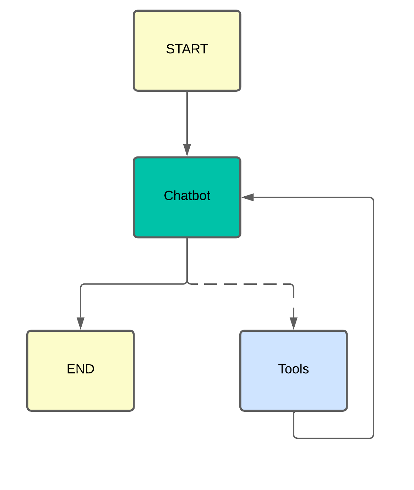

# prueba-nodeJs

Este es un proyecto en Node.js donde se implementa un agente mediante langchain y langraph que decide si buscar la información que necesita mediante la tool tavily o responder directamente.
El grafo permite decidir si el LLM responde directamente o usa una herramienta como Tavily para hacer búsquedas en la web.

## Esquema del Grafo

